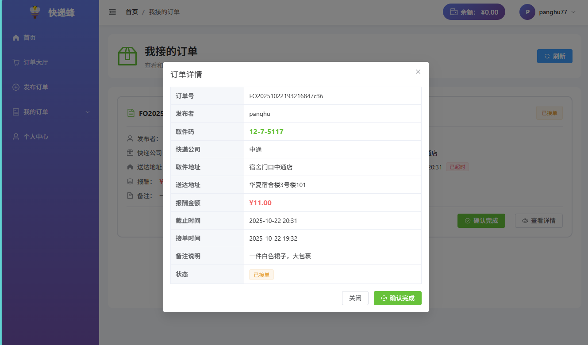

# 快递蜂后端系统

一个校园快递代取系统的后端服务，基于Spring Boot + MyBatis + Redis开发。

## 系统效果图




## 技术栈

- **Spring Boot 3.5.6** - 核心框架
- **MyBatis 3.0.3** - 持久层框架
- **MySQL 8.0+** - 数据库
- **Redis** - 缓存和Token存储
- **JWT** - 用户认证
- **Lombok** - 简化代码

## 项目结构

```
fetchbee-backend/
├── src/main/java/com/example/fetchbeebackend/
│   ├── common/          # 通用类（返回结果、状态码等）
│   ├── config/          # 配置类（Redis、Web配置等）
│   ├── controller/      # 控制器层
│   ├── dto/             # 数据传输对象
│   ├── entity/          # 实体类
│   ├── exception/       # 异常处理
│   ├── interceptor/     # 拦截器
│   ├── mapper/          # MyBatis Mapper接口
│   ├── service/         # 服务层
│   ├── utils/           # 工具类
│   └── vo/              # 视图对象
├── src/main/resources/
│   ├── mapper/          # MyBatis XML映射文件
│   └── application.properties  # 配置文件
└── db/
    └── schema.sql       # 数据库建表脚本
```

## 快速开始

### 1. 环境准备

- JDK 17+
- Maven 3.6+
- MySQL 8.0+
- Redis 6.0+

### 2. 数据库初始化

执行 `db/schema.sql` 脚本创建数据库和表：

```bash
mysql -u root -p < db/schema.sql
```

### 3. 修改配置

编辑 `src/main/resources/application.properties`，修改数据库和Redis连接信息：

```properties
# 数据库配置
spring.datasource.url=jdbc:mysql://localhost:3306/fetchbee
spring.datasource.username=root
spring.datasource.password=你的密码

# Redis配置
spring.data.redis.host=localhost
spring.data.redis.port=6379
spring.data.redis.password=你的密码（如果有）
```

### 4. 启动项目

```bash
mvn clean install
mvn spring-boot:run
```

服务将在 `http://localhost:8080` 启动。

## 用户模块API文档

### 1. 用户注册

**接口地址**：`POST /user/register`

**请求参数**：
```json
{
  "username": "testuser",
  "password": "123456"
}
```

**返回示例**：
```json
{
  "code": 200,
  "message": "注册成功",
  "data": null
}
```

---

### 2. 用户登录

**接口地址**：`POST /user/login`

**请求参数**：
```json
{
  "username": "testuser",
  "password": "123456"
}
```

**返回示例**：
```json
{
  "code": 200,
  "message": "登录成功",
  "data": {
    "token": "eyJhbGciOiJIUzI1NiJ9...",
    "userId": 1,
    "username": "testuser",
    "phone": null,
    "address": null,
    "balance": 0.00,
    "avatar": null
  }
}
```

---

### 3. 获取用户信息

**接口地址**：`GET /user/info`

**请求头**：
```
Authorization: Bearer {token}
```

**返回示例**：
```json
{
  "code": 200,
  "message": "操作成功",
  "data": {
    "id": 1,
    "username": "testuser",
    "phone": "13800138000",
    "address": "一号宿舍楼101",
    "balance": 100.00,
    "avatar": null,
    "createTime": "2024-01-01T10:00:00"
  }
}
```

---

### 4. 更新用户信息

**接口地址**：`PUT /user/info`

**请求头**：
```
Authorization: Bearer {token}
```

**请求参数**：
```json
{
  "phone": "13800138000",
  "address": "一号宿舍楼101",
  "avatar": "http://example.com/avatar.jpg"
}
```

**返回示例**：
```json
{
  "code": 200,
  "message": "更新成功",
  "data": null
}
```

---

### 5. 修改密码

**接口地址**：`PUT /user/password`

**请求头**：
```
Authorization: Bearer {token}
```

**请求参数**：
```json
{
  "oldPassword": "123456",
  "newPassword": "654321"
}
```

**返回示例**：
```json
{
  "code": 200,
  "message": "修改密码成功",
  "data": null
}
```

---

### 6. 用户登出

**接口地址**：`POST /user/logout`

**请求头**：
```
Authorization: Bearer {token}
```

**返回示例**：
```json
{
  "code": 200,
  "message": "登出成功",
  "data": null
}
```

## 状态码说明

| 状态码 | 说明 |
|-------|------|
| 200 | 操作成功 |
| 400 | 参数错误 |
| 401 | 未授权 |
| 403 | 禁止访问 |
| 404 | 资源不存在 |
| 500 | 服务器错误 |
| 1001 | 用户名已存在 |
| 1002 | 用户不存在 |
| 1003 | 密码错误 |
| 1004 | 余额不足 |
| 1005 | Token无效 |
| 1006 | Token过期 |

## 测试建议

使用 **Postman** 或 **Apifox** 进行接口测试：

1. 先调用注册接口创建用户
2. 调用登录接口获取Token
3. 在后续请求的Header中添加 `Authorization: Bearer {token}`
4. 测试其他需要认证的接口

## 注意事项

1. **Token有效期**：7天，过期后需要重新登录
2. **密码加密**：目前使用MD5加密，生产环境建议使用BCrypt
3. **跨域配置**：已在WebConfig中配置，支持跨域请求
4. **数据库连接**：确保MySQL和Redis服务已启动
5. **日志级别**：开发环境设置为DEBUG，生产环境建议改为INFO

## 下一步开发计划

- [ ] 订单管理模块
- [ ] 接单管理模块
- [ ] 余额充值功能
- [ ] 订单状态流转
- [ ] 消息通知功能

## 开发者

胖虎

